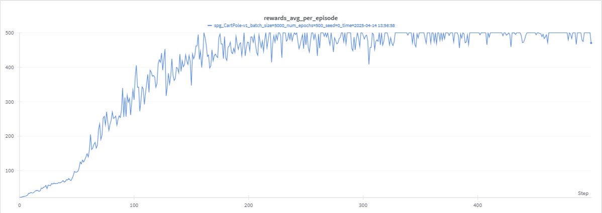

## Vanilla Policy Gradients

Implementation of the Vanilla Policy Gradients (a.k.a REINFORCE) from the [Spinning Up docs](https://spinningup.openai.com/en/latest/spinningup/rl_intro3.html#deriving-the-simplest-policy-gradient).
- Library - [Gymnasium](https://gymnasium.farama.org/)
- Main reference code : [Spinning Up implementation for policy gradient](https://github.com/openai/spinningup/blob/master/spinup/examples/pytorch/pg_math/1_simple_pg.py)
- Assistant: [Deepdeek](https://chat.deepseek.com/), [Grok](https://grok.com/)

### Notes
From the [reference document](https://spinningup.openai.com/en/latest/spinningup/rl_intro3.html), 

$$\hat{g} = -\frac{1}{|\mathcal{D}|} \sum_{\tau \in \mathcal{D}} \sum_{t=0}^{T} \nabla_{\theta} \log \pi_{\theta}(a_t |s_t) R(\tau)$$

The implementation in this repo is

$$ \hat{g} = \nabla_\theta \mathcal{L}(\theta) = -\frac{1}{N}\sum_{i=1}^N \nabla_\theta \log \pi_\theta(a_i|s_i) \tilde{G}_i $$

where $$ G_i = \sum_{k=i}^{T_{ep}} \gamma^{k-i} r_k $$ (discounted rewards) and $$ \tilde{G}_i $$ is normalized discounted rewards.
### Repository structure
- `spg_cartpole.py` implements the code to run the vanilla policy gradient agent on Cartpole.
- `videos` dir that contains video logs of evaluating the agent periodically.

### Args (for reproducibility)
The `SPGArgs` class in `spg_cartpole.py` contains all the hyperparams used in this implementation. For the sake of redundancy, 
- `seed: Int = 0`
- `env_name: str = "CartPole-v1"`
- `hidden_size: Int = 64`
- `num_epochs: Int = 500`
- `project_name: str = "policy_gradients"`
- `apply_discount: Bool = True`
- `gamma: Float = 0.99`
- `lr: Float = 0.002`
- `batch_size: Int = 5000`
- `device: str = "cuda:3"`
- `video_interval: Int = 10 ` 
- `video_length: Int = 500`

### Culmulative rewards

### To run
`python main.py`
